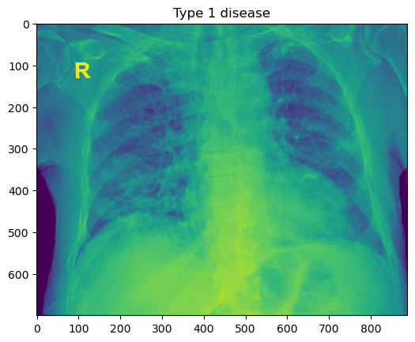
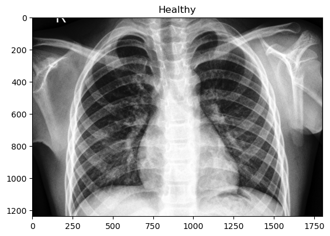
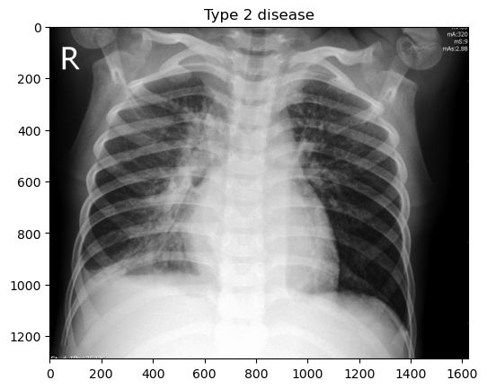
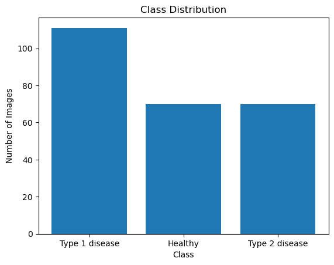
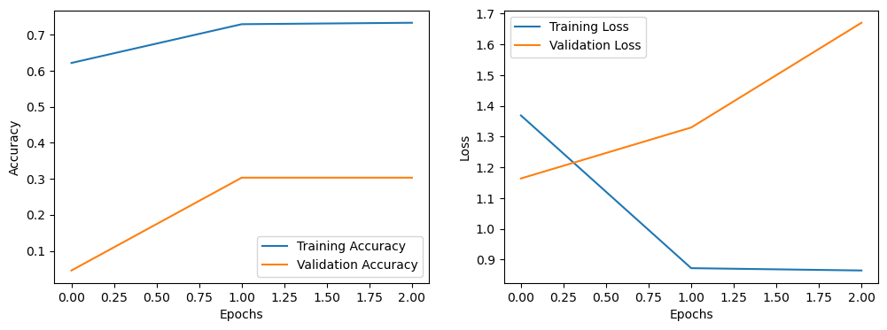
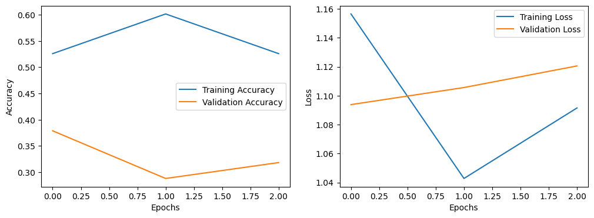
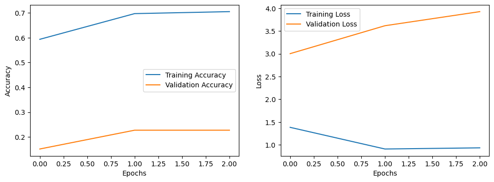

# Lung Infection Classification

## Project Overview

This project focuses on the classification of lung infections in medical images. The primary objective is to build a robust deep-learning model for early detection of lung diseases, specifically distinguishing between "healthy" and "diseased" lung images.

## Dataset

- The dataset used in this project comprises medical images categorized into "healthy," "type 1 disease," and "type 2 disease" classes.

Fig: Type 1 Disease

Fig: Healthy Lungs

Fig: Type 2 Disease

Fig: All class distribution

## Models

### Custom CNN
- A custom Convolutional Neural Network (CNN) designed for this classification task.
- Achieved an accuracy of 48.48% and demonstrated competitive performance.

Fig: CNN Accuracy and Loss

### MobileNet Transfer Learning
- Transfer learning using the MobileNet model pre-trained on ImageNet.
- Achieved an accuracy of 27.27%, highlighting the effectiveness of transfer learning.

Fig: MobileNet Accuracy and Loss

### DenseNet121 Transfer Learning
- Transfer learning using the DenseNet121 model pre-trained on ImageNet.
- Achieved an accuracy of 28.79%, showcasing the potential of different pre-trained models.

Fig: DenseNet121 Accuracy and Loss

## Prerequisites

- Python (3.6+)
- Required libraries and dependencies (listed in the code notebook)

## Project Structure

The project structure is organized as follows:

- `src/`: Source code, including data preparation, model building, and evaluation scripts.
- `README.md`: This file.

## Usage

- To run the project and train/evaluate the models, refer to the provided Python scripts in the notebook.
- Customize the project settings, model architectures, and data paths as needed.

## Conclusion

Despite the modest performance of the models in this iteration, the project lays the foundation for further research and development. Addressing class imbalances, collecting more diverse data, and exploring advanced model architectures are essential for improving classification accuracy in future work.

## Acknowledgments

- We would like to acknowledge [kaggle](https://www.kaggle.com/datasets/vikrantrajput/lungs-disease-data) for providing the dataset used in this project.

## Contact

- MD Fahim Afridi Ani
- fahimafridi043@gmail.com
- www.linkedin.com/in/fahim043

Feel free to reach out if you have any questions or feedback!

